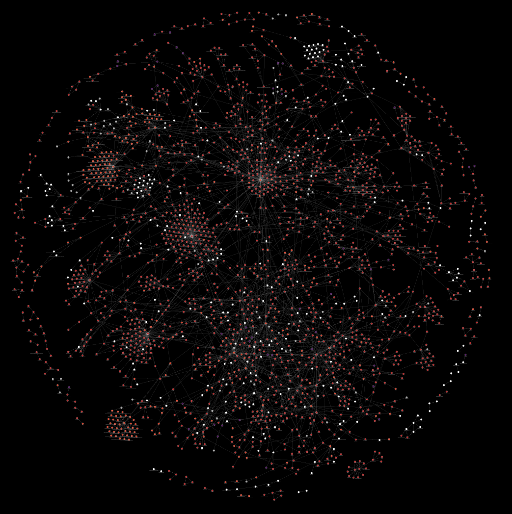

<h1 align="center">HADR</h1>

  <em>Retrieval-Augmented Generation (RAG) + Knowledge Graphs for scalable requirements traceability</em>

  
  

  
   
  <em>Example knowledge graph with traceability links across artifacts.</em>

---

## What this repo is

**HADR** is the official open-source implementation of **"Teaching to Understand, Understanding to Teach: Retrieval Augmented Generation for Requirements Traceability"** — a NASA-JPL–originated system for automated, scalable requirements traceability across engineering artifacts.

The system accepts engineering artifacts — requirements, test cases, and supplemental documents — and suggests bidirectional traceability mappings between them. It does so by constructing a **knowledge graph** from the artifact corpus via structured entity–relation extraction, then driving retrieval-augmented generation (RAG) over that graph to surface, rank, and summarize evidence for trace links.

At its core, the system introduces **Hierarchical Artifact Decomposition-Recomposition (HADR)**: a preprocessing method that decomposes artifacts of arbitrary length into a depth-two tree of branch and leaf chunks, recomposes context upward through multi-level summarization, and extracts entities and relations in a decoupled, structured manner — ensuring implicit dependencies between requirements and tests are made explicit before graph construction ever begins. All system logic is governed through a custom API, enabling modularity and extensibility across the full pipeline.

---

## Abstract
Requirement traceability, validation, and verification grow increasingly complex as engineering projects scale in size and interdependence. Technical specifications contain valuable structural information in natural language form. Advances in Large Language Models (LLMs) and their effectiveness in natural language processing and reasoning make specifications corpora amenable to information extraction and relational reasoning. While traditional requirements and test engineering methods rely on human expertise, LLMs have shown comparable performance in retrieval-augmented reasoning tasks. We propose Hierarchical Artifact Decomposition-Recomposition (HADR), a knowledge graph construction method for reasoning-based requirements tracing that decomposes artifacts into hierarchical chunk trees via branch and leaf operations, recomposing context through upward summarization, preserving all artifact content. By explicitly decoupling entity extraction from relation inference, HADR surfaces implicit relational information prior to graph construction, enabling context-aware retrieval and reasoning across linked artifacts. Integrated into a RAG pipeline, the resulting knowledge graph supports scalable, multi-artifact requirements traceability. Our tracing method leverages context-rich representations within the knowledge graph, enabling ranked traceability linkages for requirement and test case decomposition, knowledge graph search, and result summarization.

---

## Core idea (HADR → KG → RAG)

The pipeline proceeds in six conceptual stages:

1. **Ingest artifacts** — Requirements, test cases, and supplemental documents are submitted one at a time. Each artifact is checked for duplicates before entering the pipeline. The system supports bidirectional traceability (requirements ↔ test cases) as well as intra-type traceability (requirements ↔ requirements, test cases ↔ test cases).

2. **HADR decomposition** — Each artifact is tokenized and partitioned into overlapping, fixed-size *branch chunks*. Each branch is further subdivided by an LLM into semantically coherent, variable-size *leaf chunks*, forming a depth-two hierarchical tree that balances consistent segmentation with adaptive, meaning-preserving subdivision.

3. **Recomposition** — Leaf chunks within each branch subtree are summarized into a branch-level summary; branch summaries are then aggregated into a single artifact-level summary. No content is lost: all original chunk text is preserved alongside its summarized counterpart, giving downstream stages access to both granular and high-level representations.

4. **Entity extraction** — At the leaf level, an LLM extracts structured entity representations from each leaf chunk, guided by its parent branch summary and the global artifact summary. Extraction is performed independently per leaf, deliberately decoupled from relational reasoning to prevent confounding between the two tasks.

5. **Relation inference** — Relations are first inferred at the branch level using the union of all leaf-level entity sets within each branch, grounded in raw branch text and informed by the artifact summary. A semantic similarity step then identifies the most related branches across the corpus and extracts cross-artifact "global" relations via cosine similarity over branch embeddings. Local and global relations are merged to form the final **knowledge graph**.

6. **RAG over the KG** — The knowledge graph drives retrieval: given a query artifact, the system traverses the graph to retrieve evidence, ranks candidate trace links, and generates a summarized traceability result.

---

## Project outline
Project structure, docs, and additional notes:  
- https://tuutrag-open.github.io/tuutrag-open/

---

## Dataset
- PDF → Image dataset: https://www.kaggle.com/datasets/pablobedolla/pdf-to-image-data/data/data/data/data/data/data

---

## Project & publication details

| Resource | Details |
| :--- | :--- |
| Original Code | https://github.com/bedolpab/tuutrag |
| NASA Release | https://software.nasa.gov/software/NPO-53610-1 |
| Reference Number | NPO-53610-1 |
| Category | Aeronautics |
| Release Type | Open Source |

---

## Development guidelines (minimal)
- **Commits**: Conventional Commits  
- **Branches**: Conventional Branches  
- **Reviews**: 2 approvals required before merge to `main`

---

## Team & collaborators

| Role | Name | Affiliation |
| :--- | :--- | :--- |
| Mentor | Gus Razo | Jet Propulsion Laboratory / California Institute of Technology |
| Mentor | Kae Sawada | Jet Propulsion Laboratory / California Institute of Technology |
| Mentor | Edwin Quintanilla | Jet Propulsion Laboratory / California Institute of Technology |
| Academic Collaborator/Intern | Pablo Cesar Bedolla Ortiz | Dominican University |
| Academic Collaborator | Marlon Selvi | Dominican University |
| Academic Collaborator | Eduardo Gaborit | University of Illinois Urbana-Champaign |
| Academic Collaborator | Bryan Gaborit | J Sterling Morton East High School |

---

## Usage of generative AI
Any usage of Generative AI tools is disclosed below. To be clear, AI was not used for any expert knowledge, design analysis, critical thinking, or safety-critical decisions. All core intellectual work, collaboration, and final judgments were entirely human-driven.

I. _Documentation_: Assistance in formatting `README.md`  
II. _Website_: Assistance in styling and formatting of the `tuutrag-open.github.io` website.

---

## NASA-JPL / Caltech acknowledgement
The original research was carried out at the Jet Propulsion Laboratory, California Institute of Technology, and was sponsored by the National Aeronautics and Space Administration. This existing work is currently being continued at Dominican University.
